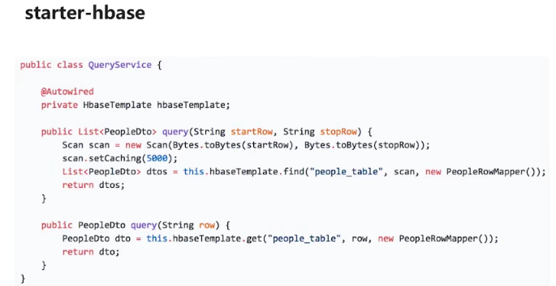

# 一、应用框架设计


# 二、缓存层设计


# 三、常用工具类

## 1.日期和字符串处理工具类：apache DateUtils/RandomStringUtils

```sh
        <dependency>
            <groupId>commons-lang</groupId>
            <artifactId>commons-lang</artifactId>
            <version>2.6</version>
        </dependency>
```

例如


## 2.Md5等文件加密校验工具类


## 3.HbaseORM工具类

```xml
		<dependency>
			<groupId>com.spring4all</groupId>
			<artifactId>spring-boot-starter-hbase</artifactId>
			<version>1.0.0.RELEASE</version>
		</dependency>
```


使用方法





# 四、日志处理设计

## 1.原因

记录并且分析用户行为。

## 2.日志分类主要包括：记录日志和分析日志。


# 五、异常处理


# 六、表结构设计

## 1.商户投放子系统

### 1.1 商户信息-mysql


### 1.2 优惠券信息-hbase

o：限制条件；b：基本条件


### 1.3 优惠卷Token信息

保存在文件


## 2.用户应用子系统

### 2.1 pass用户优惠卷表


template_id：

token:0，或者-1，代表是否有token

assigned_date：获取日期

con_date:消费日期

### 2.2 Feedback：用户反馈基本信息


user_id:哪那个用户

type:评论类型


### 2.3 User表-》id生成器


b：基本信息；o：额外信息。


#### id生成策略：


rowkey生成策略：就是当前用户总数和5位随机数计算获得。